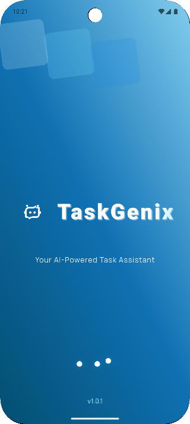
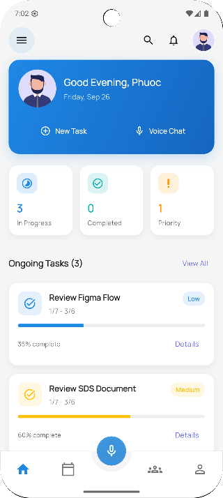
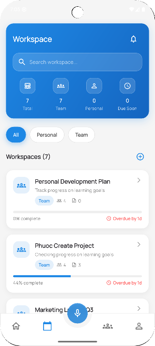
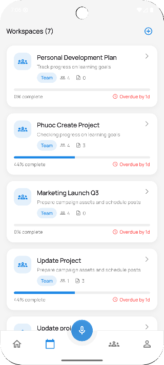
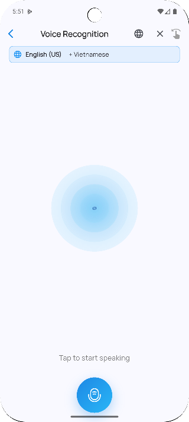
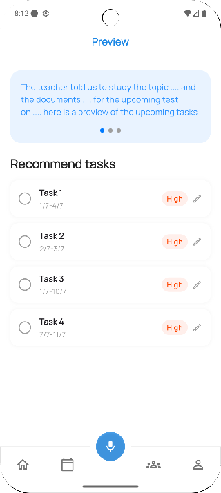
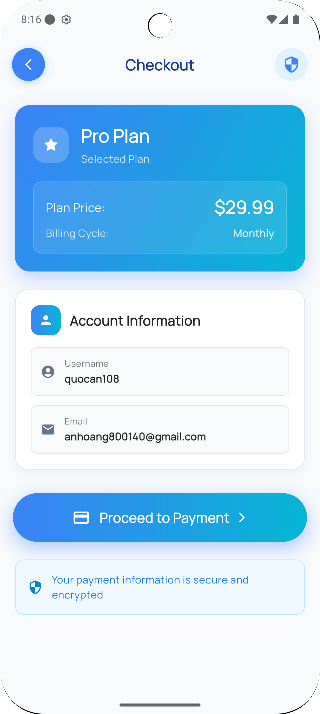
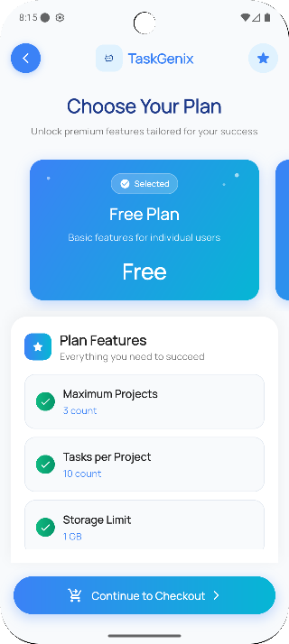
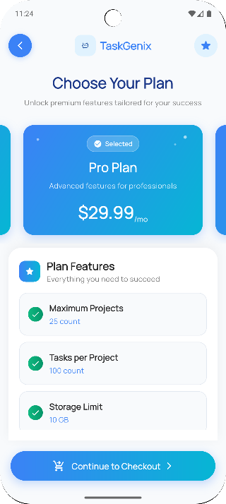
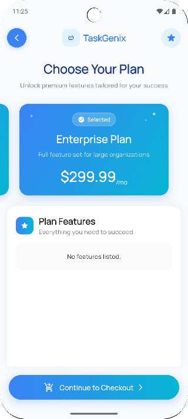

  
# 🚀 TaskGenix

### *"Let AI Handle The Notes — You Lead The Work"*

---

## 👋 Welcome to TaskGenix

**TaskGenix** is a Web/App platform that integrates artificial intelligence (AI) to automatically summarize audio content, list action items (checklist), and suggest/assign tasks after meetings. 

Live demo: https://task-genix.com/

We meet the increasing demand of people in the digital age: **"Quick meetings – Quick decisions – Quick actions."**

> 💡 TaskGenix uses AI to take notes and summarize meetings, so you can skip manual note-taking and focus on what matters most: **leading, creating, and making decisions.**

---

## ✨ Key Features

| Feature | Description |
|---------|-------------|
| 🎙️ **AI Audio Transcription** | Automatically transcribe meeting audio to text |
| 📝 **Smart Summarization** | Get concise meeting summaries powered by AI |
| ✅ **Action Item Extraction** | Automatically identify and list action items |
| 👥 **Task Assignment** | AI suggests and assigns tasks to team members |
| 📊 **Dashboard Analytics** | Track meeting insights and productivity |

---

## 📸 App Screenshots

### Intro

### Home & Overview

### 📋 Task Management

### 📊 Analytics View

### 📱 Mobile Experience

---

## 💰 Pricing Plans

<table>
<tr>
<td align="center"> <b>Free</b></td>
<td align="center"> <b>Pro</b></td>
<td align="center"> <b>Team</b></td>
<td align="center"> <b>Enterprise</b></td>
</tr>
</table>

---

## 🛠️ Tech Stack

- 🤖 **AI/ML** - Advanced natural language processing
- 🌐 **Web** - Modern responsive design
- 📱 **Mobile** - Cross-platform app support
- ☁️ **Cloud** - Scalable infrastructure

---

## 🚀 Getting Started

1. **Sign Up** - Create your free account
2. **Connect** - Link your meeting platforms
3. **Meet** - Conduct your meetings as usual
4. **Review** - Get AI-generated summaries and action items
5. **Act** - Complete assigned tasks efficiently

---

## 🤝 Contributing

We welcome contributions from the community! Feel free to:

- 🐛 Report bugs
- 💡 Suggest features
- 🔧 Submit pull requests

---

## 📫 Contact Us

---

**Made with ❤️ by the TaskGenix Team**

*Transforming meetings into actionable results*

